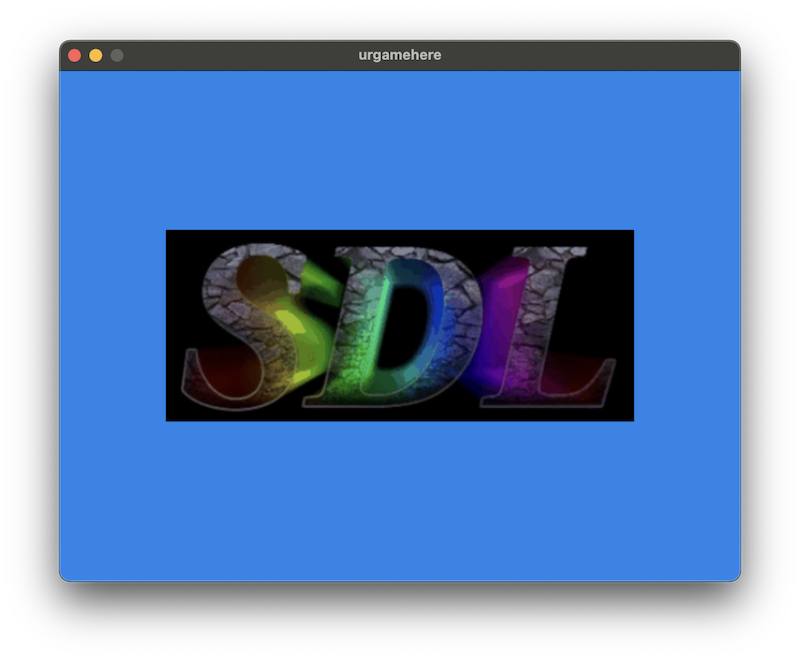

# Nim + SDL3 Web Template

This is a simple VS Code project for writing little web games with Nim and SDL3.
It is intended primarily for game jams and other small, web-friendly projects.

Press F5 to build and run in debug mode.

**Note: This template uses a precompiled archive of SDL3 for its web builds.
It will be updated occasionally to keep up with SDL3's releases.**

Several tasks are included:
- **Test (Web)** - Build web and run it in your default browser.
- **Build (Web)** - Build web without running.
  - I've set up web builds to use `-d:release` always, but your preferences may differ!
- **Test (Debug)** - Build and run native debug build.
- **Build (Debug)** - Build native debug without running.
- **Test (Release)** - Build and run native in release mode.

## Prerequisites

- You need SDL3 and Nim, obviously.
- You need Emscripten in your PATH to create and test web builds.
- You need LLDB to run the included debugger tasks.

## To-Do

- [ ] _Maybe_ see if we can do sourcemaps. Feels like overkill!
